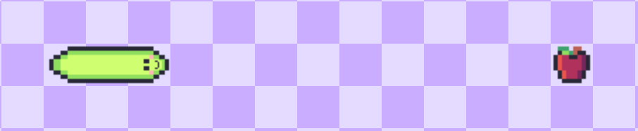

# README Project 1

- The classic snake game made with vanilla JavaScript and DOM manipulation.
  

- Instructions to play
  - Move the snake with arrow keys &nbsp; ◀ ▶ ▲ ▼ 
  - Eat apples to make the snake grow &nbsp; 

  - Avoid colliding with borders and the snake itself!

- Demo
  - [https://superquique.github.io/snake-project/](https://superquique.github.io/snake-project/)

 

## Resources

- Snake Wikepedia Article: [https://en.wikipedia.org/wiki/Snake_(video_game_genre)](https://en.wikipedia.org/wiki/Snake_(video_game_genre))

